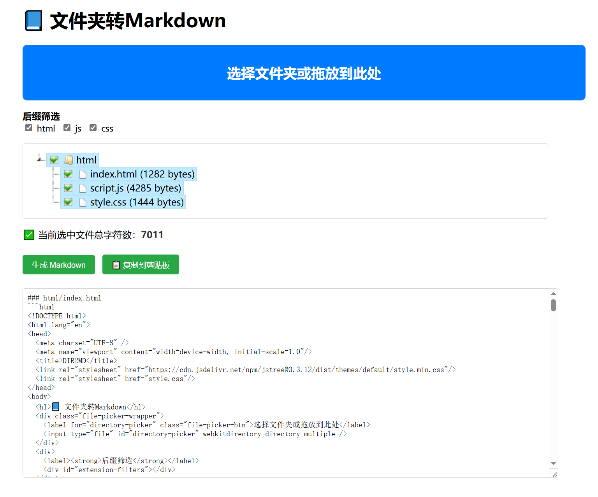

# repo2md

## 📦 repo2md 版本清单

### ✅ 已完成
- [x] 🌐 Web 版
- [x] 🐍 Python GUI 版

### 🚧 开发中
- [ ] ⚡ VS Code 插件版

### 📋 待开发

- [ ] 💻 CLI 命令行版
- [ ] 🤖 Android App

----

我在用LLMs看项目代码的时候，会把代码文件按照项目结构树和项目内容一起复制到Markdown一个文档内，方便上下文分析。但是每次都手动这么做的话着实有点麻烦，因此想到实现此工具---用于把项目文件夹直接生成好文档。先搜一下看看有没有类似的工具吧，没想到还真搜到了：[DIR2MD](https://tomisfat.github.io/dir2md/)  `Github`仓库：[TomIsFat/dir2md: 转换文件夹内所有代码文件为统一的markdown，用于让GPT更了解您的项目代码](https://github.com/TomIsFat/dir2md)

于是我拿来借鉴一下，原本是想做一个桌面版工具的，但没想到他弄的是网页的似乎更好，我决定两个都做一下，网页的就在此基础上进行完善吧。

> 转换仓库或项目内所有代码文件为统一的markdown，用于让LLMs更了解您的项目代码
>
> Convert all code files in the folder to a unified markdown for LLMs to better understand your project code

在线使用： https://www.jinmajue.top/repo2md



----

[toc]

# 项目文件夹转Markdown工具

将本地项目文件夹快速转换为结构化的Markdown文档，包含目录树和文件内容，适合项目文档生成、代码分享和AI对话输入。

## ✨ 核心功能
- 📁 **智能文件夹选择**：支持现代浏览器原生API，兼容传统模式
- 🌲 **可视化目录树**：实时展示项目结构，支持多选/取消
- 🔍 **后缀名筛选**：快速过滤不需要的文件类型
- 📦 **文件大小统计**：实时计算选中文件总大小
- 🛡️ **安全检测**：自动识别敏感文件并发出警告
- ⚡ **二进制文件识别**：自动跳过图片、压缩包等非文本文件
- 📋 **一键复制/导出**：生成Markdown后可快速复制或下载
## 🚀 使用方法
### 1. 选择项目文件夹
点击"📁 选择文件夹（推荐）"按钮，选择你的项目根目录：
- 现代浏览器（Chrome 86+、Edge 86+）：使用原生文件夹选择器
- 其他浏览器：自动降级为传统文件选择模式
### 2. 筛选文件
- **后缀筛选**：取消勾选不需要的后缀名，如 `png`、`jpg`、`zip` 等
- **目录树选择**：在可视化树形结构中勾选需要的文件
### 3. 生成Markdown
点击"生成 Markdown"按钮，工具会：
1. 构建ASCII目录树
2. 流式读取文本文件内容
3. 自动跳过二进制文件
4. 检测可能的敏感文件（如包含 `.env`、`password` 等）
### 4. 导出结果
- **复制到剪贴板**：直接粘贴到其他应用
- **导出为文件**：下载 `.md` 文件保存
## 📦 项目结构
```
repo2md/
├── index.html      # 主页面
├── script.js       # 核心逻辑
└── style.css       # 样式文件
```
## 🛠️ 技术特点
- **纯前端实现**：无需后端服务器，完全本地运行
- **流式文件读取**：使用 `File.stream()` API，大文件不阻塞UI
- **智能二进制检测**：结合扩展名和文件魔数双重判断
- **渐进式增强**：自动检测浏览器能力，降级方案保证兼容性
## 🎯 适用场景
- 📝 **项目文档生成**：快速生成包含目录结构和代码的文档
- 🤖 **AI对话输入**：将整个项目转为Markdown格式，方便粘贴到ChatGPT等AI工具
- 👥 **代码分享**：将项目代码打包成单个Markdown文件，便于分享和存档
- 📊 **项目分析**：快速浏览项目结构和关键文件内容
## ⚠️ 注意事项
1. **敏感信息安全**：工具会检测可能包含敏感信息的文件，但请务必自行检查输出内容
2. **大文件处理**：超大文本文件可能需要较长时间处理，建议先筛选
3. **浏览器兼容性**：现代浏览器（Chrome 86+、Firefox 111+、Edge 86+）体验最佳
4. **本地运行**：所有处理都在本地完成，不会上传任何文件
## 🔧 本地部署
```bash
# 克隆项目
git clone https://github.com/vestjin/repo2md.git
# 进入目录
cd repo2md
# 使用任意HTTP服务器运行，例如：
python -m http.server 8000
# 或
npx serve
```
然后在浏览器中打开 `http://localhost:8000` 即可使用。
## 📄 生成的Markdown格式示例
```markdown
# 项目概览：your-project
## 📁 目录结构
your-project/
├── src/
│   ├── index.js
│   └── utils.js
└── package.json

## 📄 文件内容
### `src/index.js`
``javascript
//你的代码内容...
``
### `package.json`
``json
{
  "name": "your-project"
}
``
```
## 🤝 贡献指南
欢迎提交 Issue 和 Pull Request！
1. Fork 本仓库
2. 创建特性分支 (`git checkout -b feature/AmazingFeature`)
3. 提交更改 (`git commit -m 'Add some AmazingFeature'`)
4. 推送到分支 (`git push origin feature/AmazingFeature`)
5. 提交 Pull Request
## 📜 许可证
本项目采用 GPLv3 许可证 
---
**💡 提示**：这个工具特别适合与ChatGPT等AI工具配合使用，可以将整个项目上下文快速转换为结构化的Markdown格式，便于AI理解和分析你的代码。

